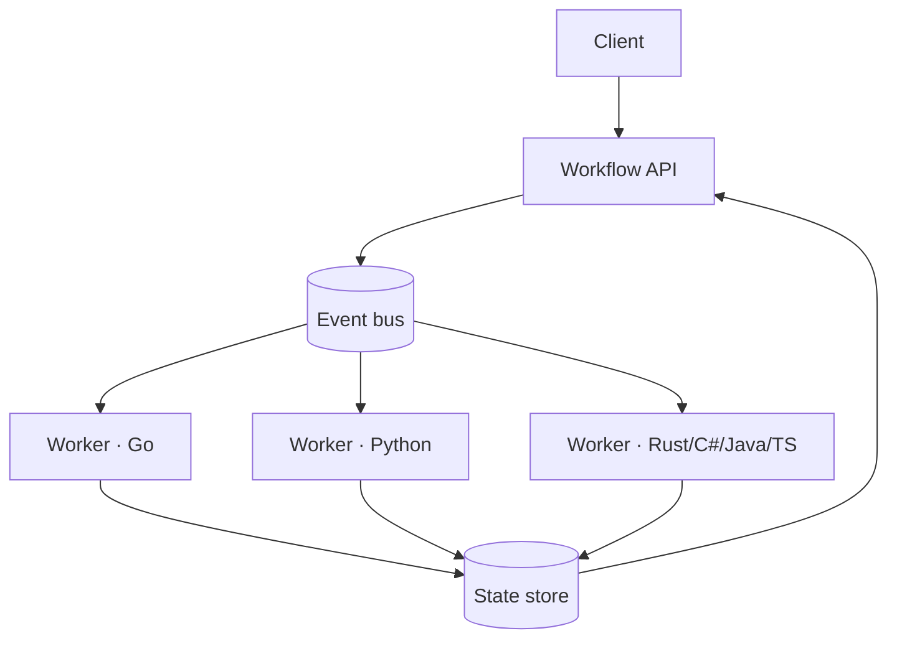

# FlowForge — durable workflow execution engine

FlowForge runs multi-step workflows across a fleet of workers while surviving worker
crashes, duplicate messages, retries, and partial failures. It's the architecture
behind durable-execution systems (Temporal, Cadence, AWS Step Functions) built small
enough to read, with the failure handling made explicit and tested rather than claimed.

The interesting part isn't "uses Kafka" — it's the answer to *what happens when a
worker dies halfway through a task*, proven with a chaos test rather than a sentence.



## Polyglot by design

The engine owns durable state; **workers speak one shared contract** and come in six
languages — Go, Python, Rust, C#, Java, TypeScript — the same way Temporal ships SDKs
in many languages against one backend. A Python worker and a Go worker are
interchangeable on the same workflow because they derive the **same idempotency key**
and the **same retry backoff** from [`contracts/`](contracts/), checked byte-for-byte
in CI.

## The failure scenario this is built to answer

```
Worker crashes halfway through a task
        │
        ▼
Lease expires  ──▶  another worker claims the task
        │
        ▼
Idempotency check  ──▶  the already-done side effect is skipped
        │
        ▼
Task safely resumes — no duplicate charge, no lost work
```

## Engineering questions the docs answer

Why an event bus? What delivery guarantee? How is idempotency implemented and how are
duplicates handled? What happens when a worker crashes, or the database is
unavailable? How are workflows replayed and versioned? How does it behave under
backpressure and scale horizontally? See [`architecture/`](architecture/) and the
[ADRs](architecture/ADR/).

## Status

Built in the open, incrementally. Current:

- [x] Cross-language contract (idempotency key + backoff) with pinned vectors
- [x] Engine core: task state machine, lease recovery, retry→DLQ (Go, tested)
- [x] Engine service: HTTP API over a durable store, runs end-to-end
- [x] Workers in all six languages against the contract, conformance-checked
- [x] React operator console (live task states, retries, DLQ)
- [x] docker-compose stack — engine + multi-language worker fleet
- [x] Chaos test: kill a worker mid-task, prove idempotent recovery
- [x] Load test + honest benchmarks
- [x] ADRs 001–004 + architecture overview


## Run it

```
# the whole stack: engine + a Go and Python worker
docker compose -f infrastructure/docker-compose.yml up --build

# the signature failure test — crash a worker mid-task, watch it recover
go run ./chaos-tests/crash_recovery

# measured throughput and latency on your machine
go run ./load-tests/throughput
```

See [BENCHMARKS.md](BENCHMARKS.md) for numbers and [architecture/](architecture/) for
the design and ADRs.

## Layout

```
flowforge/
├── contracts/       the shared event + idempotency contract, with vectors
├── services/
│   ├── engine-go/   the durable engine (API, bus, state store, leasing)
│   └── worker-*/    interchangeable workers in six languages
├── ui/              React operator console
├── architecture/    overview, scalability, consistency, failure-model + ADRs
├── infrastructure/  docker-compose: bus, Postgres, Redis
├── load-tests/      measured throughput and latency
├── chaos-tests/     kill a worker mid-task; prove idempotent recovery
└── benchmarks/      honest, reproducible numbers
```

Part of [parag-labs](https://github.com/parag-labs).
