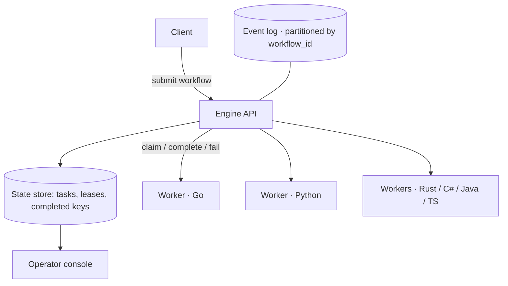

# FlowForge architecture

A durable workflow execution engine: it runs multi-step workflows across a fleet of
interchangeable workers while surviving worker crashes, duplicate messages, retries,
and partial failures.

## Components

- **Engine** — owns durable state and the task lifecycle. Exposes an HTTP API to submit
  workflows and for workers to claim/complete/fail tasks.
- **Workers** — six interchangeable implementations (Go, Python, Rust, C#, Java, TS)
  that speak one contract. Any mix drains the same workflows.
- **Operator console** — a React UI that polls live task state.

## The guarantees, in one place

| Concern | Guarantee | Where |
|---------|-----------|-------|
| Delivery | At-least-once | [ADR-001](ADR/001-event-bus.md) |
| Duplicate effects | Collapsed by idempotency key | [ADR-002](ADR/002-idempotency.md) |
| Ordering | Per-workflow, via partitioning | [ADR-003](ADR/003-partitioning.md) |
| Task ownership | Single owner via time-bounded lease | [ADR-004](ADR/004-state-management.md) |
| Crash recovery | Lease expiry -> re-claim -> safe resume | [chaos test](../chaos-tests/) |
| Durability | Postgres state store (in-mem reference) | [ADR-004](ADR/004-state-management.md) |

## Answers to the engineering questions

- **Why an event log?** Replay and independent consumers; see ADR-001.
- **What delivery guarantee?** At-least-once, made safe by idempotency (ADR-002).
- **How is idempotency implemented?** A key derived from `workflow_id|task_id|attempt`,
  deduplicated in the state store (ADR-002).
- **How are duplicates handled?** A completion with a seen key is a no-op returning the
  cached result — demonstrated in the chaos test.
- **What happens when a worker crashes?** Its lease expires and the task returns to
  PENDING for another worker; the retried attempt gets a fresh key (ADR-004).
- **How is task ownership recovered?** Time-bounded lease + transactional claim (ADR-004).
- **What happens when the database is unavailable?** Claims fail closed — a task is never
  handed out without a durable lease write — so no work is lost, only paused.
- **How are workflows replayed and versioned?** The log is the history; a run replays
  from an offset (ADR-001).
- **How does it behave under backpressure and scale?** More partitions and workers;
  the state-store claim is the throughput lever (see [BENCHMARKS](../BENCHMARKS.md)).
- **Consistency guarantees?** The effect runs at least once and is recorded at most once;
  not a distributed transaction, which is the honest guarantee durable-execution systems
  make.
